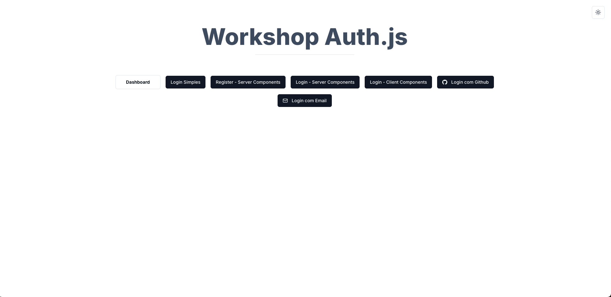

<h1 align="center">
    
</h1>
<p align="center">Workshop Codante - NextAuth.js. Um projeto onde foram estudadas as implementações do novo NextAuth.js e Auth.js 5, abrangendo login por credenciais, GitHub, e link mágico, com exemplos em Server Components e Client Components.</p>
<p align="center">
 <a href="#sobre-o-projeto">Sobre o Projeto</a> |
 <a href="#tecnologias">Tecnologias</a> |
 <a href="#iniciando-o-projeto">Iniciando o Projeto</a> |
 <a href="#licença">Licença</a> |
 <a href="#autor">Autor</a> 
</p>

---

### Sobre o Projeto

O projeto **workshop-codante-next-auth** foi desenvolvido durante um workshop que explorou o novo **NextAuth.js** (versão 5) e **Auth.js**. O objetivo é demonstrar como implementar autenticação em um aplicativo Next.js usando diversos métodos:

- Login por credenciais (convencional)
- Login com GitHub
- Login via link mágico
- Implementações utilizando tanto **Server Components** quanto **Client Components**

Além disso, o design system das páginas foi construído utilizando o **ShadCN**, garantindo uma interface moderna e consistente.

---

### Tecnologias

- [Next.js](https://nextjs.org/) - Framework React para produção
- [NextAuth.js 5](https://next-auth.js.org/) - Biblioteca de autenticação para Next.js
- [React](https://reactjs.org/) - Biblioteca JavaScript para construção de interfaces de usuário
- [Auth.js](https://authjs.dev/) - Sistema de autenticação unificado
- [TypeScript](https://www.typescriptlang.org/) - Superconjunto de JavaScript que adiciona tipagem estática opcional
- [Tailwind CSS](https://tailwindcss.com/) - Framework para estilização rápida e responsiva
- [ShadCN](https://shadcn.dev/) - Design system para construção de interfaces com componentes acessíveis

---

### Como Começar

```bash
# Clone o projeto
$ git clone https://github.com/sillasemanoel/workshop-codante-next-auth

# Navegue até o diretório do projeto
$ cd workshop-codante-next-auth

# Instale as dependências
$ npm install

# Inicie o aplicativo
$ npm run dev

---

### Licença

Distribuído sob a Licença MIT. Veja [LICENSE](LICENSE) para mais informações.

---

### Autor

Feito por Sillas Emanoel 👋🏽